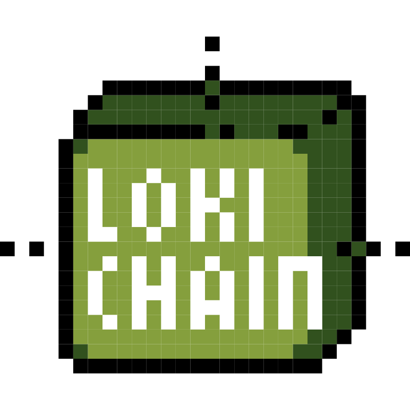

# lokichain

`lokichain` blockchain is an experimental blockchain written in pure Rust.

This is not production ready. Chain can and will change, as will its API.

## Todo

This is a young repository. Work plan:
- [ ] Blockchain domain
- [ ] PoW/PoS plan
- [ ] Cli
- [ ] Api
